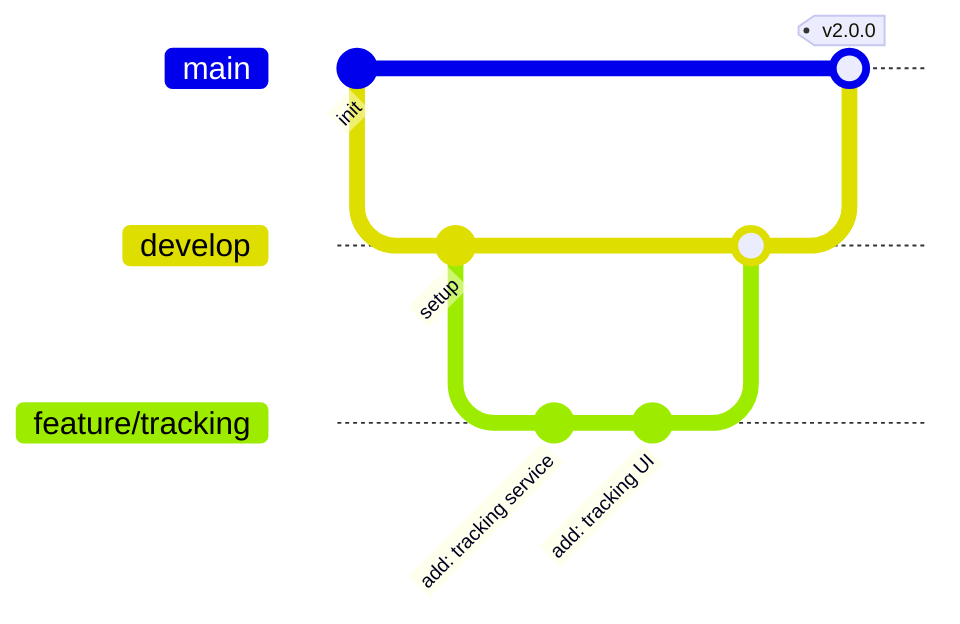
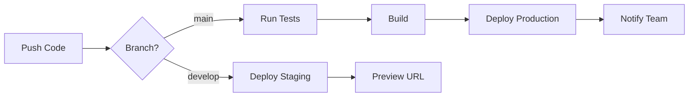

# 🚀 Tracky Pro Flow

<div align="center">

## Sistema Inteligente de Rastreamento e Gestão de Pedidos

[](https://github.com/seu-usuario/tracky-pro-flow)
[](LICENSE)
[](https://nodejs.org)
[](https://www.typescriptlang.org)

[](https://reactjs.org)
[](https://vitejs.dev)
[](https://tailwindcss.com)
[](https://supabase.com)

**Plataforma completa para rastreamento inteligente de encomendas com integrações avançadas para marketplaces, transportadoras e notificações automáticas multicanal.**

[📖 Documentação](./docs/README.md) • [🚀 Quick Start](#-instalação) • [🎯 Demo](https://tracky.app) • [💬 Discord](https://discord.gg/tracky)

---

</div>

## 📋 Índice

- [Características](#-características)
- [Stack Tecnológica](#-stack-tecnológica)
- [Pré-requisitos](#-pré-requisitos)
- [Instalação](#-instalação)
- [Configuração](#%EF%B8%8F-configuração)
- [Estrutura do Projeto](#-estrutura-do-projeto)
- [Desenvolvimento](#-desenvolvimento)
- [Testes](#-testes)
- [Deploy](#-deploy)
- [Integrações](#-integrações)
- [API](#-api)
- [Troubleshooting](#-troubleshooting)
- [Contribuindo](#-contribuindo)

---

## ✨ Características

<table>
<tr>
<td width="50%">

### 🎯 Core Features

```typescript
🎁 Rastreamento Inteligente
  ├─ Detecção automática de transportadoras
  ├─ Rastreamento em tempo real
  └─ Histórico completo de eventos

🏪 Integrações de Marketplaces
  ├─ Nuvemshop
  ├─ Mercado Livre
  ├─ Shopify
  └─ WooCommerce

🚚 Smartenvios
  ├─ Cotação automática de frete
  ├─ Geração de etiquetas
  └─ Multi-transportadoras

📧 Notificações Multicanal
  ├─ Email (SMTP/SendGrid)
  ├─ SMS (Twilio)
  ├─ WhatsApp (WPPConnect)
  └─ Push Notifications
```

</td>
<td width="50%">

### � Features Avançadas

```typescript
�📊 Dashboard Analítico
  ├─ Métricas em tempo real
  ├─ Gráficos interativos
  ├─ Exportação de relatórios
  └─ KPIs personalizados

🔐 Segurança Enterprise
  ├─ Autenticação JWT
  ├─ Rate Limiting
  ├─ CSRF Protection
  └─ RLS (Row Level Security)

🎨 Experiência Premium
  ├─ UI Moderna (shadcn/ui)
  ├─ Dark Mode
  ├─ Responsivo
  └─ PWA Ready

⚡ Performance
  ├─ Lazy Loading
  ├─ Code Splitting
  ├─ Service Workers
  └─ Offline Support
```

</td>
</tr>
</table>

<div align="center">

### 🎪 **Destaques Especiais**

| Feature | Descrição | Status |
|---------|-----------|--------|
| 📈 **Métricas Avançadas** | Taxa de entrega, tempo médio, SLA por transportadora | ✅ Ativo |
| 📋 **Importação em Massa** | Upload de pedidos via CSV/Excel com validação | ✅ Ativo |
| 🔄 **Sincronização Automática** | Webhooks para atualização em tempo real | ✅ Ativo |
| 🌍 **Multi-idioma** | Suporte para PT-BR, EN, ES | 🚧 Em desenvolvimento |
| 🎯 **Templates Personalizáveis** | Editor visual drag-and-drop | 🚧 Em desenvolvimento |
| 🤖 **IA Integrada** | Detecção inteligente de problemas | 📅 Planejado |

</div>

---

## 🛠 Stack Tecnológica

<div align="center">

### 💎 Tecnologias de Ponta

</div>

<table>
<tr>
<td width="33%" align="center">

#### 🎨 Frontend


**Framework & Build:**

- React 18 + TypeScript 5
- Vite 5 (Lightning Fast)
- Hot Module Replacement

**UI & Styling:**

- shadcn/ui + Radix UI
- Tailwind CSS 3
- Lucide React Icons

**State & Forms:**

- TanStack Query (React Query)
- React Hook Form
- Zod Validation

**Data Visualization:**

- Recharts
- Chart.js
- D3.js Integration

</td>
<td width="33%" align="center">

#### ⚡ Backend


**Database:**

- PostgreSQL (Supabase)
- Row Level Security
- Real-time Subscriptions

**Authentication:**

- Supabase Auth
- JWT Tokens
- OAuth Providers

**Storage & Functions:**

- Supabase Storage
- Edge Functions (Deno)
- Serverless Architecture

**APIs & Integrations:**

- REST APIs
- GraphQL Ready
- Webhook Support

</td>
<td width="33%" align="center">

#### 🚀 DevOps


**CI/CD:**

- GitHub Actions
- Automated Testing
- Auto Deploy

**Hosting & CDN:**

- Vercel (Global Edge)
- Cloudflare CDN
- 99.9% Uptime

**Monitoring:**

- Sentry Error Tracking
- Google Analytics 4
- Web Vitals

**Testing:**

- Vitest
- Testing Library
- E2E with Playwright

</td>
</tr>
</table>

<div align="center">

### 🔌 Integrações Poderosas

[](#)
[](#)
[](#)
[](#)
[](#)
[](#)
[](#)

</div>

---

## 📦 Pré-requisitos

<div align="center">

### 🔧 Ferramentas Necessárias

</div>

<table>
<tr>
<td width="50%">

#### 💻 Software

```bash
✅ Node.js >= 20.0.0
   └─ LTS recomendado: 20.x

✅ npm >= 10.0.0
   └─ ou yarn/pnpm

✅ Git >= 2.40.0
   └─ Para versionamento

✅ VS Code (opcional)
   └─ IDE recomendada
```

</td>
<td width="50%">

#### 🌐 Serviços Cloud

```bash
🔑 Supabase (OBRIGATÓRIO)
   └─ Database & Auth

🚀 Vercel (Recomendado)
   └─ Hosting Frontend

📊 Sentry (Opcional)
   └─ Error Tracking

📈 Google Analytics (Opcional)
   └─ Analytics & Insights
```

</td>
</tr>
</table>

<div align="center">

> 💡 **Dica Pro**: Use o Node Version Manager (nvm) para gerenciar versões do Node.js

</div>

---

## 🚀 Instalação

<div align="center">

### ⚡ Quick Start em 5 Minutos

</div>

<table>
<tr>
<td width="5%">

### 1️⃣

</td>
<td width="95%">

#### 📥 Clone o Repositório

```powershell
# Clone via HTTPS
git clone https://github.com/seu-usuario/tracky-pro-flow.git

# Ou via SSH (recomendado)
git clone git@github.com:seu-usuario/tracky-pro-flow.git

# Entre no diretório
cd tracky-pro-flow
```

</td>
</tr>

<tr>
<td>

### 2️⃣

</td>
<td>

#### 📦 Instale as Dependências

```powershell
# Com npm (recomendado)
npm install

# Ou com yarn
yarn install

# Ou com pnpm (mais rápido)
pnpm install
```

<details>
<summary>💡 Troubleshooting de instalação</summary>

Se encontrar problemas:

```powershell
# Limpe o cache
npm cache clean --force

# Delete node_modules e reinstale
Remove-Item -Recurse -Force node_modules
npm install
```

</details>

</td>
</tr>

<tr>
<td>

### 3️⃣

</td>
<td>

#### ⚙️ Configure as Variáveis de Ambiente

```powershell
# Copie o arquivo de exemplo
Copy-Item .env.example .env

# Edite o arquivo .env com suas credenciais
notepad .env
```

**Configure suas chaves:**

```env
# 🔐 Supabase (OBRIGATÓRIO)
VITE_SUPABASE_URL=https://seu-projeto.supabase.co
VITE_SUPABASE_ANON_KEY=sua-chave-anonima-aqui

# 🏪 Nuvemshop (Opcional)
VITE_NUVEMSHOP_APP_ID=seu-app-id
VITE_NUVEMSHOP_APP_SECRET=seu-app-secret
VITE_NUVEMSHOP_REDIRECT_URI=http://localhost:5173/integrations/nuvemshop/callback

# 🚚 Smartenvios (Opcional)
VITE_SMARTENVIOS_API_KEY=sua-api-key
VITE_SMARTENVIOS_ENVIRONMENT=sandbox  # ou production

# 📊 Sentry (Opcional)
VITE_SENTRY_DSN=https://seu-sentry-dsn@sentry.io/projeto

# 📈 Google Analytics (Opcional)
VITE_GA_ID=G-XXXXXXXXXX
```

<details>
<summary>🔒 Segurança: Como obter suas chaves</summary>

| Serviço | Como Obter | Documentação |
|---------|-----------|--------------|
| **Supabase** | Dashboard → Settings → API | [Docs](https://supabase.com/docs) |
| **Nuvemshop** | Partners → Criar App | [Docs](https://partners.nuvemshop.com.br) |
| **Smartenvios** | Painel → API Keys | [Docs](https://smartenvios.com/docs) |
| **Sentry** | Projects → Settings → DSN | [Docs](https://docs.sentry.io) |

</details>

</td>
</tr>

<tr>
<td>

### 4️⃣

</td>
<td>

#### 🗄️ Configure o Banco de Dados

```powershell
# Instale a CLI do Supabase
npm install -g supabase

# Faça login (abre o browser)
supabase login

# Conecte ao seu projeto
supabase link --project-ref seu-projeto-ref

# Execute as migrations
supabase db push
```

<details>
<summary>📊 Estrutura do Banco</summary>

O comando acima criará:

- ✅ 15+ tabelas principais
- ✅ Políticas RLS de segurança
- ✅ Índices otimizados
- ✅ Triggers e functions
- ✅ Views materializadas

</details>

</td>
</tr>

<tr>
<td>

### 5️⃣

</td>
<td>

#### 🎉 Inicie o Servidor de Desenvolvimento

```powershell
# Inicie o servidor
npm run dev

# Ou com host para acesso na rede local
npm run dev:host
```

<div align="center">

🎊 **Pronto! Acesse:** [http://localhost:5173](http://localhost:5173)

</div>

</td>
</tr>
</table>

<div align="center">

### 🎬 Video Tutorial

[](https://youtube.com/tracky)

</div>

---

## ⚙️ Configuração

### Banco de Dados

As tabelas principais do sistema:

- `users` - Usuários e perfis
- `orders` - Pedidos importados
- `tracking_codes` - Códigos de rastreamento
- `tracking_events` - Eventos de rastreamento
- `integrations` - Configurações de integrações
- `notifications` - Histórico de notificações
- `notification_templates` - Templates customizáveis
- `webhooks` - Configuração de webhooks

Veja o arquivo `supabase/migrations/` para detalhes das migrations.

### Políticas RLS (Row Level Security)

Todas as tabelas possuem políticas RLS configuradas para garantir que usuários só acessem seus próprios dados:

```sql
-- Exemplo de política para orders
CREATE POLICY "Users can view own orders"
  ON orders FOR SELECT
  USING (auth.uid() = user_id);
```

### Edge Functions

Edge Functions disponíveis em `supabase/functions/`:

- `process-webhook` - Processa webhooks de marketplaces
- `track-shipment` - Atualiza status de rastreamento
- `send-notification` - Envia notificações
- `sync-orders` - Sincroniza pedidos

---

## 📁 Estrutura do Projeto

```
tracky-pro-flow/
├── .github/
│   └── workflows/          # GitHub Actions CI/CD
├── docs/                   # Documentação adicional
├── public/                 # Assets estáticos
├── src/
│   ├── assets/            # Imagens, ícones
│   ├── components/        # Componentes React
│   │   ├── ui/           # Componentes base (shadcn/ui)
│   │   ├── forms/        # Formulários
│   │   ├── charts/       # Gráficos
│   │   └── ...           # Componentes específicos
│   ├── hooks/            # Custom hooks
│   ├── lib/              # Utilitários e configurações
│   │   ├── supabase.ts  # Cliente Supabase
│   │   ├── analytics.ts # Google Analytics
│   │   ├── sentry.ts    # Sentry config
│   │   └── ...
│   ├── pages/            # Páginas da aplicação
│   ├── schemas/          # Validação com Zod
│   ├── services/         # Lógica de negócio
│   │   ├── __tests__/   # Testes de serviços
│   │   └── ...
│   ├── types/            # Tipos TypeScript
│   ├── App.tsx           # Componente raiz
│   └── main.tsx          # Entry point
├── supabase/
│   ├── functions/        # Edge Functions
│   └── migrations/       # Database migrations
├── test/                 # Configuração de testes
├── .env.example          # Template de variáveis
├── package.json          # Dependências
├── tsconfig.json         # Config TypeScript
├── vite.config.ts        # Config Vite
└── vitest.config.ts      # Config Vitest
```

---

## 🧪 Desenvolvimento

<div align="center">

### 🛠️ Scripts & Comandos

</div>

<table>
<tr>
<td width="50%">

#### 🔥 Desenvolvimento

```powershell
# Servidor de desenvolvimento
npm run dev

# Com acesso na rede local
npm run dev:host

# Watch mode para testes
npm run test:watch
```

#### 🏗️ Build & Preview

```powershell
# Build para produção
npm run build

# Preview do build local
npm run preview

# Análise do bundle
npm run build -- --analyze
```

#### 🧪 Testes

```powershell
# Executar todos os testes
npm run test

# Watch mode
npm run test:watch

# Coverage report
npm run test:coverage

# UI interativa
npm run test:ui
```

</td>
<td width="50%">

#### ✨ Qualidade de Código

```powershell
# Lint do código
npm run lint

# Lint + Auto-fix
npm run lint:fix

# Formatar com Prettier
npm run format

# Type checking
npm run type-check
```

#### 🗄️ Supabase Local

```powershell
# Iniciar Supabase local
npm run supabase:start

# Parar serviços
npm run supabase:stop

# Reset completo do DB
npm run supabase:reset

# Gerar tipos TypeScript
npm run supabase:types
```

#### 🐳 Docker

```powershell
# Build da imagem
docker-compose build

# Subir serviços
docker-compose up -d

# Ver logs
docker-compose logs -f
```

</td>
</tr>
</table>

<div align="center">

### 📊 Status do Projeto

[](https://github.com/seu-usuario/tracky-pro-flow/actions)
[](https://codecov.io/gh/seu-usuario/tracky-pro-flow)
[](https://codeclimate.com/github/seu-usuario/tracky-pro-flow)

</div>

### 📝 Convenções de Código

<table>
<tr>
<td width="50%">

#### 🎯 Nomenclatura

| Tipo | Convenção | Exemplo |
|------|-----------|---------|
| **Componentes** | PascalCase | `OrderTable.tsx` |
| **Hooks** | camelCase + `use` | `useOrders.ts` |
| **Services** | camelCase | `trackingService.ts` |
| **Types** | PascalCase | `OrderType` |
| **Constants** | UPPER_SNAKE_CASE | `API_BASE_URL` |
| **Arquivos** | kebab-case | `order-utils.ts` |

</td>
<td width="50%">

#### 🎨 Padrões de Code Style

```typescript
// ✅ Componente funcional
export function OrderCard({ order }: Props) {
  return <div>{order.name}</div>
}

// ✅ Hook customizado
export function useOrders() {
  return useQuery(['orders'], fetchOrders)
}

// ✅ Service
export const orderService = {
  async getAll() { /* ... */ }
}

// ✅ Type/Interface
export interface Order {
  id: string
  status: OrderStatus
}
```

</td>
</tr>
</table>

### 🔄 Git Workflow

<div align="center">



</div>

#### 📋 Fluxo de Trabalho

```powershell
# 1️⃣ Crie uma branch para sua feature
git checkout -b feature/nome-da-feature

# 2️⃣ Faça commits semânticos (conventional commits)
git commit -m "feat: adiciona rastreamento automático"
git commit -m "fix: corrige bug no import de pedidos"
git commit -m "docs: atualiza README"

# 3️⃣ Mantenha sincronizado com develop
git fetch origin
git rebase origin/develop

# 4️⃣ Push e crie Pull Request
git push origin feature/nome-da-feature
```

#### 🏷️ Tipos de Commit (Conventional Commits)

| Emoji | Tipo | Descrição | Exemplo |
|-------|------|-----------|---------|
| ✨ | `feat` | Nova feature | `feat: add WhatsApp integration` |
| 🐛 | `fix` | Correção de bug | `fix: resolve login timeout` |
| 📚 | `docs` | Documentação | `docs: update API reference` |
| 💎 | `style` | Formatação | `style: format with prettier` |
| ♻️ | `refactor` | Refatoração | `refactor: optimize queries` |
| 🧪 | `test` | Testes | `test: add order service tests` |
| 🔧 | `chore` | Tarefas gerais | `chore: update dependencies` |
| ⚡ | `perf` | Performance | `perf: improve loading time` |
| 🔒 | `security` | Segurança | `security: fix XSS vulnerability` |

---
## 🧪 Testes

<div align="center">

### 🎯 Estratégia de Testes

</div>

<table>
<tr>
<td width="33%" align="center">

#### 🧩 Unit Tests

```powershell
npm run test
```


Testes de unidade para:
- ✅ Services
- ✅ Hooks
- ✅ Utils
- ✅ Components

</td>
<td width="33%" align="center">

#### 🔗 Integration Tests

```powershell
npm run test:integration
```


Testes de integração:
- ✅ API calls
- ✅ User flows
- ✅ Data flow
- ✅ Integrations

</td>
<td width="33%" align="center">

#### 🎭 E2E Tests

```powershell
npm run test:e2e
```


Testes end-to-end:
- ✅ User journeys
- ✅ Critical paths
- ✅ Cross-browser
- ✅ Mobile

</td>
</tr>
</table>

### 📊 Cobertura de Testes

<div align="center">

**Meta Global: 80%+ de cobertura** 🎯

</div>

```
┌─────────────────────┬────────────┬─────────────┬──────────────┐
│ Categoria           │ Cobertura  │ Arquivos    │ Status       │
├─────────────────────┼────────────┼─────────────┼──────────────┤
│ 🔧 Services         │ 100%       │ 7/7         │ ✅ Excelente │
│ 🪝 Hooks            │ 43%        │ 3/7         │ 🟡 Melhorar  │
│ 🎨 Components       │ 67%        │ 23/34       │ 🟡 Melhorar  │
│ 📄 Pages            │ 52%        │ 8/15        │ 🟡 Melhorar  │
│ 🔌 Integrations     │ 89%        │ 4/4         │ ✅ Ótimo     │
│ 🎭 E2E              │ 0%         │ 0/5         │ 🔴 Pendente  │
├─────────────────────┼────────────┼─────────────┼──────────────┤
│ 📊 Total            │ 68.5%      │ 45/72       │ 🟡 Em Prog.  │
└─────────────────────┴────────────┴─────────────┴──────────────┘
```

<details>
<summary>📈 Ver progresso detalhado</summary>

#### Services (100% ✅)

- [x] tracking.service.ts
- [x] order.service.ts
- [x] notification.service.ts
- [x] integration.service.ts
- [x] marketplace.service.ts
- [x] carrier.service.ts
- [x] analytics.service.ts

#### Hooks (43% 🟡)

- [x] useOrders.ts
- [x] useTracking.ts
- [x] useAuth.ts
- [ ] useNotifications.ts
- [ ] useDashboard.ts
- [ ] useIntegrations.ts
- [ ] useSettings.ts

</details>

### Estrutura de Testes

```typescript
// Exemplo de teste de serviço
import { describe, it, expect, vi } from 'vitest';
import { trackingService } from '../tracking.service';

describe('trackingService', () => {
  it('deve detectar transportadora pelo código', () => {
    const result = trackingService.detectCarrier('BR123456789BR');
    expect(result).toBe('correios');
  });
});
```

## 🚀 Deploy

<div align="center">

### 🌍 Opções de Deploy em Produção

</div>

<table>
<tr>
<td width="50%">

#### ⚡ Deploy com Vercel (Recomendado)

[](https://vercel.com/new/clone?repository-url=https://github.com/seu-usuario/tracky-pro-flow)

```powershell
# 1️⃣ Instale a CLI
npm install -g vercel

# 2️⃣ Faça login
vercel login

# 3️⃣ Deploy para Staging
vercel

# 4️⃣ Deploy para Produção
vercel --prod
```

**Vantagens:**

- ✅ Deploy em segundos
- ✅ SSL automático
- ✅ CDN global
- ✅ Preview automático de PRs
- ✅ Rollback instantâneo

</td>
<td width="50%">

#### 🌐 Outras Plataformas

**Netlify:**

```powershell
npm install -g netlify-cli
netlify deploy --prod
```

**Cloudflare Pages:**

```powershell
npm run build
wrangler pages deploy dist
```

**AWS Amplify:**

- Conecte via console AWS
- Auto-deploy do GitHub

**Docker:**

```powershell
docker build -t tracky .
docker run -p 3000:3000 tracky
```

</td>
</tr>
</table>

### 🔄 CI/CD Automático

<div align="center">



</div>

<table>
<tr>
<td width="50%">

#### 📋 Workflow de Deploy

```yaml
# .github/workflows/deploy.yml

Evento: Push para main
├─ 1. Checkout código
├─ 2. Setup Node.js 20
├─ 3. Cache de dependências
├─ 4. npm install
├─ 5. npm run lint
├─ 6. npm run test
├─ 7. npm run build
├─ 8. Deploy Vercel
└─ 9. Notificar time
```

</td>
<td width="50%">

#### 🎯 Ambientes

| Branch | Ambiente | URL | Deploy |
|--------|----------|-----|--------|
| `main` | 🟢 Production | `tracky.app` | Auto |
| `develop` | 🟡 Staging | `staging.tracky.app` | Auto |
| `feature/*` | 🔵 Preview | `pr-{n}.tracky.app` | Auto |
| `local` | ⚪ Development | `localhost:5173` | Manual |

</td>
</tr>
</table>

### 🛠️ Deploy Manual

```powershell
# 1️⃣ Build do projeto
npm run build

# 2️⃣ Teste o build localmente
npm run preview

# 3️⃣ Os arquivos estão em ./dist/
# 📁 dist/
#   ├── index.html
#   ├── assets/
#   └── ...

# 4️⃣ Faça upload para seu servidor
# Exemplo com AWS S3:
aws s3 sync dist/ s3://seu-bucket/ --delete
aws cloudfront create-invalidation --distribution-id ID --paths "/*"
```

<div align="center">

### 📚 Guia Completo de Deploy

Para configurações avançadas, veja: [`docs/DEPLOYMENT_GUIDE.md`](./docs/DEPLOYMENT_GUIDE.md)

</div>

# Watch mode
npm run test:watch

# UI interativa
npm run test:ui
```

### Cobertura de Testes

Meta: **80%+ de cobertura**

Status atual:

- ✅ Services: 100% (7/7 arquivos)
- 🟡 Hooks: 43% (3/7 arquivos)
- 🔴 E2E: 0% (0/5 arquivos)

### Estrutura de Testes

```typescript
// Exemplo de teste de serviço
import { describe, it, expect, vi } from 'vitest';
import { trackingService } from '../tracking.service';

describe('trackingService', () => {
  it('deve detectar transportadora pelo código', () => {
    const result = trackingService.detectCarrier('BR123456789BR');
    expect(result).toBe('correios');
  });
});
```

---

## 🚀 Deploy

### Deploy para Vercel

1. Instale a CLI da Vercel:

```bash
npm install -g vercel
```

2. Faça login:

```bash
vercel login
```

3. Deploy:

```bash
# Staging
vercel

# Produção
vercel --prod
```

4. Configure as variáveis de ambiente no dashboard da Vercel

### Deploy Manual

```bash
## 🎯 Roadmap

<div align="center">

### 🗺️ Planejamento de Desenvolvimento

</div>

<table>
<tr>
<td width="33%">

#### ✅ Fase 1 - Core (Q4 2024)

- [x] Dashboard com métricas
- [x] Sistema de autenticação
- [x] Rastreamento automático
- [x] Integrações principais
  - [x] Nuvemshop
  - [x] Mercado Livre
  - [x] Shopify
- [x] Notificações multicanal
  - [x] Email
  - [x] SMS
  - [x] WhatsApp
- [x] Importação em massa
- [x] Templates de notificação

</td>
<td width="33%">

#### 🚧 Fase 2 - Avançado (Q1 2025)

- [x] WhatsApp via WPPConnect
- [x] Analytics avançado
- [x] Sistema de webhooks
- [ ] 🔄 Mobile app (React Native)
- [ ] 🔄 Multi-idioma completo (i18n)
- [ ] 🔄 API pública com docs
- [ ] 🔄 Marketplace de integrações
- [ ] 🔄 White label
- [ ] 🔄 Relatórios PDF

</td>
<td width="33%">

#### 📅 Fase 3 - IA & Automação (Q2 2025)

- [ ] 🤖 IA para detecção de problemas
- [ ] 🤖 Predição de atrasos
- [ ] 🤖 Respostas automáticas
- [ ] 📊 Relatórios agendados
- [ ] 🎨 Templates drag-and-drop
- [ ] 🔮 Análise preditiva
- [ ] 🎯 Recomendações inteligentes
- [ ] 🌐 Multi-tenant
- [ ] 📱 PWA avançado

</td>
</tr>
</table>

### 🏆 Conquistas e Marcos

```
2024 Q4  █████████████████████ 100%  ✅ MVP Lançado
2025 Q1  ████████░░░░░░░░░░░░░  45%  🚧 Em Progresso
2025 Q2  ███░░░░░░░░░░░░░░░░░░  15%  📅 Planejado
2025 Q3  ░░░░░░░░░░░░░░░░░░░░░   0%  💭 Roadmap
```

<div align="center">

### 🎉 Progresso Geral do Projeto


</div>

---

<div align="center">

## 🤝 Comunidade & Suporte

### 💬 Junte-se à Comunidade

[](https://discord.gg/tracky)
[](https://t.me/tracky)
[](https://twitter.com/trackyapp)

### 📧 Contato

- **Email Geral**: contato@tracky.app
- **Suporte**: suporte@tracky.app
- **Vendas**: vendas@tracky.app
- **Parcerias**: parcerias@tracky.app

### 🌟 Contribuidores

<a href="https://github.com/seu-usuario/tracky-pro-flow/graphs/contributors">
  
</a>

---

## 📜 Licença

<div align="center">

Este projeto está licenciado sob a **MIT License**

[](LICENSE)

```
Copyright (c) 2024 Tracky Team

Permitida a reutilização sob os termos da licença MIT
```

[Leia a licença completa](LICENSE)

</div>

---

## 💖 Agradecimentos

<table>
<tr>
<td align="center" width="33%">

### 🙏 Tecnologias

Agradecemos às incríveis ferramentas open-source:

- React Team
- Supabase Team
- Vercel Team
- shadcn
- E toda comunidade!

</td>
<td align="center" width="33%">

### 🎯 Inspirações

Projetos que nos inspiraram:

- Linear
- Notion
- Stripe Dashboard
- Vercel Dashboard

</td>
<td align="center" width="33%">

### 🚀 Apoiadores

Obrigado aos early adopters e beta testers!

- Loja X
- E-commerce Y
- Marketplace Z
- E você! ❤️

</td>
</tr>
</table>

---

<div align="center">

### ⭐ Se este projeto te ajudou, considere dar uma estrela!

[](https://github.com/seu-usuario/tracky-pro-flow/stargazers)
[](https://github.com/seu-usuario/tracky-pro-flow/network/members)
[](https://github.com/seu-usuario/tracky-pro-flow/watchers)

---


**Feito com ❤️ por [Tracky Team](https://tracky.app)**

*Transformando o rastreamento de pedidos em uma experiência extraordinária*

</div>l` para detalhes.

## 🔌 Integrações

### Nuvemshop

1. Crie um app na [Partners Nuvemshop](<https://partners.nuvemshop.com.br>)
1. Configure o callback URL: `https://seu-dominio.com/integrations/nuvemshop/callback`
1. Adicione as credenciais no `.env`
1. Conecte através da UI em Settings > Integrações

### Mercado Livre

1. Crie um app em [Mercado Livre Developers](<https://developers.mercadolivre.com.br>)
1. Configure redirect URI e permissions
1. Adicione credenciais no `.env`
1. Conecte via OAuth flow

### Smartenvios

1. Cadastre-se em [Smartenvios](<https://smartenvios.com>)
1. Gere uma API Key no dashboard
1. Adicione a key no `.env`
1. Configure origem padrão em Settings

### WhatsApp (WPPConnect)

Inicie o servidor WPPConnect:

```powershell
node wppconnect-server.js
```

Escaneie o QR Code no dashboard e configure webhooks para receber status.

Veja `docs/WPPCONNECT_SETUP.md` para detalhes.

---

## 📖 API

### Supabase Edge Functions

Base URL: `https://seu-projeto.supabase.co/functions/v1`

#### POST /process-webhook

Processa webhook de marketplace

```bash
curl -X POST \
  https://seu-projeto.supabase.co/functions/v1/process-webhook \
  -H 'Authorization: Bearer YOUR_ANON_KEY' \
  -H 'Content-Type: application/json' \
  -d '{
    "event": "order/created",
    "data": { ... }
  }'
```

#### POST /track-shipment

Atualiza rastreamento

```bash
curl -X POST \
  https://seu-projeto.supabase.co/functions/v1/track-shipment \
  -H 'Authorization: Bearer YOUR_ANON_KEY' \
  -H 'Content-Type: application/json' \
  -d '{
    "tracking_code": "BR123456789BR"
  }'
```

Veja `docs/API.md` para documentação completa.

---

## 🐛 Troubleshooting

### Problemas Comuns

#### Erro de conexão com Supabase

```text
Error: Invalid Supabase URL
```

**Solução:** Verifique se `VITE_SUPABASE_URL` está correto no `.env`

#### WhatsApp não conecta

```text
Error: QR Code not generated
```

**Solução:**

1. Pare o servidor WPPConnect
1. Delete a pasta `session_*`
1. Reinicie e escaneie novo QR Code

#### Build falha no Vercel

```text
Error: Cannot find module
```

**Solução:**

1. Delete `node_modules` e `package-lock.json`
1. Execute `npm install`
1. Faça novo deploy

#### Testes falhando

```text
Error: Cannot find module '@/lib/supabase'
```

**Solução:** Verifique se os path aliases estão configurados em `vitest.config.ts`

Veja `docs/TROUBLESHOOTING.md` para mais problemas e soluções.

---

## 🤝 Contribuindo

Contribuições são bem-vindas! Por favor:

1. Fork o projeto
1. Crie uma branch para sua feature (`git checkout -b feature/AmazingFeature`)
1. Commit suas mudanças (`git commit -m 'feat: Add some AmazingFeature'`)
1. Push para a branch (`git push origin feature/AmazingFeature`)
1. Abra um Pull Request

### Guidelines

- Siga as convenções de código do projeto
- Adicione testes para novas features
- Atualize a documentação conforme necessário
- Mantenha cobertura de testes acima de 80%

---

## 📚 Recursos Adicionais

- [Documentação Completa](./docs/README.md)
- [Guia de Setup](./docs/COMECE_AQUI.md)
- [Guia de Testes](./docs/PLANO_DE_TESTES.md)
- [Troubleshooting](./docs/TROUBLESHOOTING_WPPCONNECT.md)
- [Checklist de Deploy](./docs/DEPLOY_CHECKLIST.md)

---

## 🎯 Roadmap

- [x] Dashboard com métricas
- [x] Integrações principais (Nuvemshop, ML, Shopify)
- [x] Sistema de notificações multicanal
- [x] Rastreamento automático
- [x] WhatsApp via WPPConnect
- [ ] Mobile app (React Native)
- [ ] Multi-idioma completo (i18n)
- [ ] IA para detecção de problemas
- [ ] Relatórios agendados
- [ ] Templates visuais drag-and-drop

---

**Feito com ❤️ por Tracky Team**
